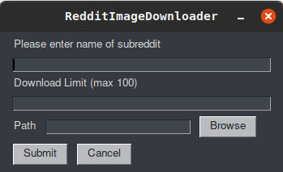
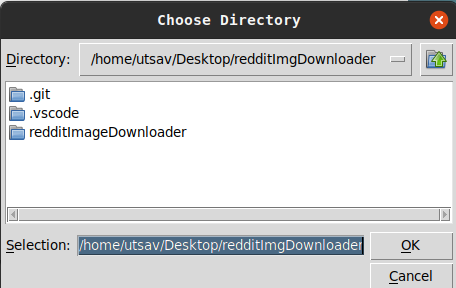

## Reddit Image Downloader v1.0
A simple python program that allows users to download images from Reddit

## Project Status
This project is currently in development. Users can input subreddit, provide download path and set limits on number of images to download.
Functionality to select top, hot, new and sort by time in progress.
User input validation needs to be implemented as well.

## Project Screen Shot(s)

## Installation and Setup Instructions

#### Example:  

Clone down this repository. You will need `praw` and `pythonsimplegui` installed globally on your machine.
See requirements.txt for more info

## Reflections

  - I was intersted in scraping content from reddit. I discovered praw which makes it awfully simple to achive this. Then instead of relying on hardcoding
    the details I decided to include a GUI that would allow the user to set the subreddits.
  
  - I originally planned it to download top posts from photography websites to automaitcally download images for ever changing background but I figured a GUI
    would provide flexibility to download anything.
    
  - Unlike web based projects, which are easily hosted I had to spend time figuring how I could share this project and discovered the convention when it comes to
    inlcuded libraries and informing your user on how to use the project.
    
  - I wasn't able to use praw.ini to store credentials like how it is mentioned in their documentation. It gives me an error trying to authenticate even though I
    followed all the instructions. I coulnd't find much info on it on the web so I decided to just use the read-only feature to create the reddit instance.
    
  - I used praw and pythonsimplegui as they seemed to be simple enough to use and were elegant.
  
